# Multi-Regulation Management System - Flow Charts

**Visual Process Documentation**

---

## Table of Contents

1. [System Architecture](#1-system-architecture)
2. [User Flows](#2-user-flows)
3. [Data Flow](#3-data-flow)
4. [Component Interaction](#4-component-interaction)
5. [State Management](#5-state-management)

---

## 1. System Architecture

### 1.1 High-Level Architecture

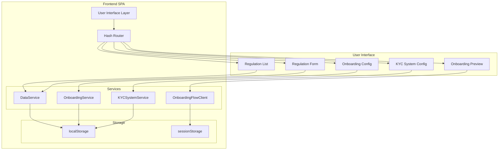

### 1.2 Component Hierarchy

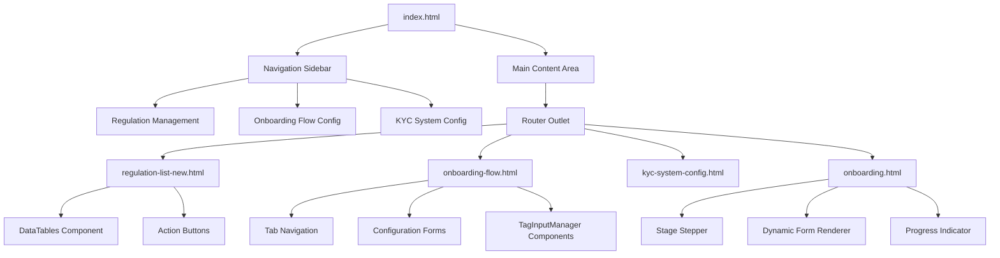

---

## 2. User Flows

### 2.1 Create Regulation Flow

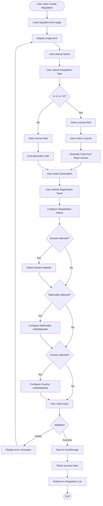

### 2.2 Configure Onboarding Flow

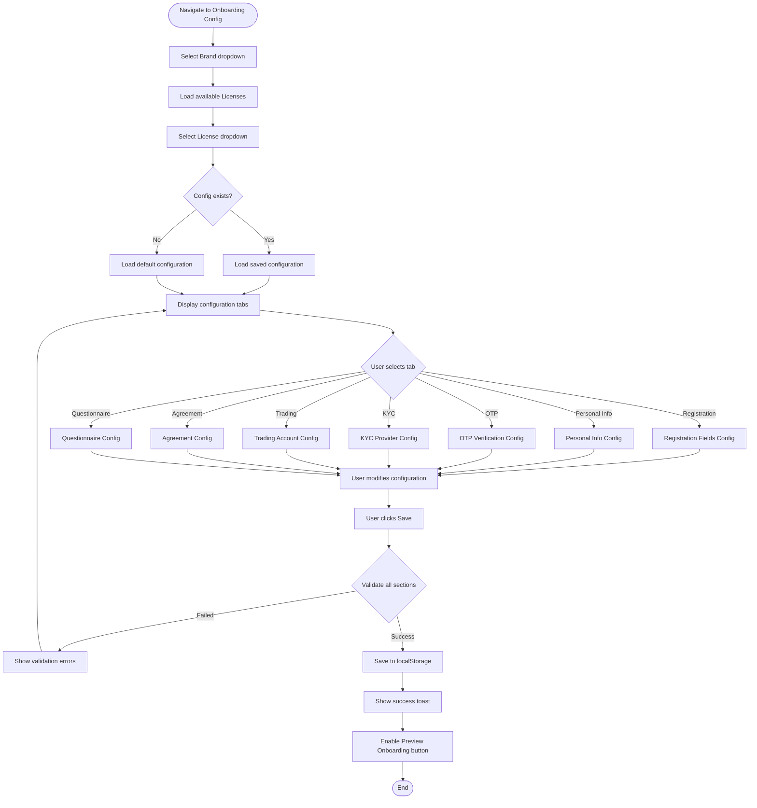

### 2.3 User Onboarding Journey (onboarding.html)

```mermaid
flowchart TD
    Start([User opens onboarding.html]) --> Stage1[Stage 1: Registration]
    
    Stage1 --> FillEmail[Fill Email, Password]
    FillEmail --> FillCountry[Select Country, Nationality]
    FillCountry --> FillDomain[Select Domain]
    
    FillDomain --> SubmitReg[Submit Registration]
    SubmitReg --> MatchLicense[System matches Brand+License]
    
    MatchLicense --> CheckMatch{Match found?}
    CheckMatch -->|No| ShowError1[Show error: No regulation found]
    CheckMatch -->|Yes| LoadConfig[Load Onboarding Config]
    
    ShowError1 --> Stage1
    
    LoadConfig --> Stage2[Stage 2: Personal Info]
    Stage2 --> FillPersonal[Fill dynamic fields]
    FillPersonal --> SendOTP[System sends OTP]
    SendOTP --> Stage3[Stage 3: OTP Verification]
    
    Stage3 --> EnterOTP[Enter OTP code]
    EnterOTP --> VerifyOTP{OTP valid?}
    VerifyOTP -->|No| ShowError2[Show error: Invalid OTP]
    VerifyOTP -->|Yes| Stage4[Stage 4: Identity Verification]
    
    ShowError2 --> Stage3
    
    Stage4 --> CheckKYCEnabled{KYC enabled?}
    CheckKYCEnabled -->|No| Stage5[Stage 5: Trading Account]
    CheckKYCEnabled -->|Yes| SelectPOI[Upload POI document]
    
    SelectPOI --> SelectPOA[Upload POA document]
    SelectPOA --> ValidateAddr[Validate POA address]
    ValidateAddr --> SubmitKYC[Submit to KYC provider]
    
    SubmitKYC --> Stage5
    Stage5 --> SelectAccount[Select MT4/MT5]
    SelectAccount --> CreateAccount[Create trading account]
    
    CreateAccount --> Stage6[Stage 6: Agreement]
    Stage6 --> ShowAgreements[Display agreements]
    ShowAgreements --> CheckMethod{Selection method?}
    
    CheckMethod -->|All| CheckAll[User must agree to all]
    CheckMethod -->|Any| CheckAny[User must agree to at least one]
    
    CheckAll --> AgreeAll{All agreed?}
    CheckAny --> AgreeAny{Any agreed?}
    
    AgreeAll -->|No| ShowError3[Show error: Must agree to all]
    AgreeAll -->|Yes| Stage7[Stage 7: Questionnaire]
    
    AgreeAny -->|No| ShowError4[Show error: Must agree to at least one]
    AgreeAny -->|Yes| Stage7
    
    ShowError3 --> Stage6
    ShowError4 --> Stage6
    
    Stage7 --> CheckQEnabled{Questionnaire enabled?}
    CheckQEnabled -->|No| Complete[Stage 8: Complete]
    CheckQEnabled -->|Yes| ShowQuestions[Display questions]
    
    ShowQuestions --> AnswerQ[User answers questions]
    AnswerQ --> CheckPopup{Option has popup?}
    CheckPopup -->|Yes| ShowPopup[Display popup dialog]
    CheckPopup -->|No| NextQuestion[Continue to next question]
    
    ShowPopup --> UserConfirm{User confirms?}
    UserConfirm -->|No| AnswerQ
    UserConfirm -->|Yes| NextQuestion
    
    NextQuestion --> AllAnswered{All answered?}
    AllAnswered -->|No| AnswerQ
    AllAnswered -->|Yes| CalcScore[Calculate total score]
    
    CalcScore --> CheckScore{Score >= pass criteria?}
    CheckScore -->|No| ShowFailure[Show failure message]
    CheckScore -->|Yes| Complete
    
    ShowFailure --> Stage7
    
    Complete --> ShowSuccess[Display completion screen]
    ShowSuccess --> End([End])
```

---

## 3. Data Flow

### 3.1 Regulation Data Flow

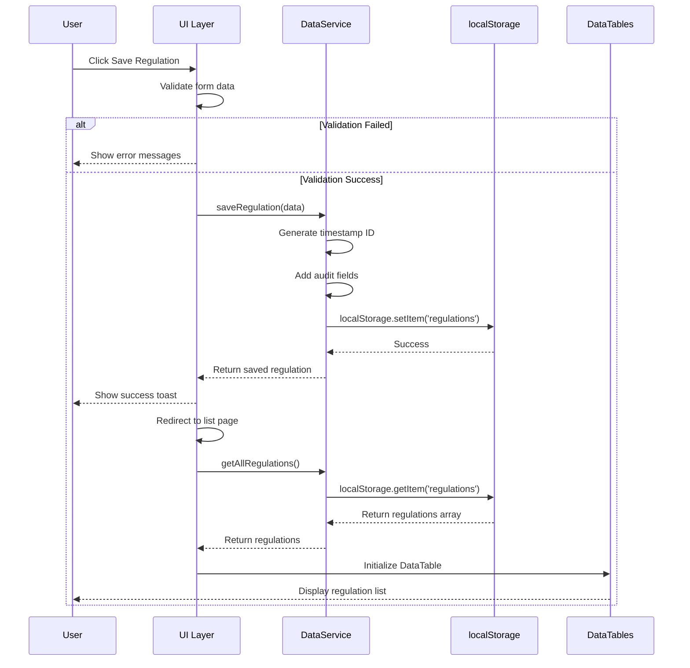

### 3.2 Onboarding Configuration Data Flow

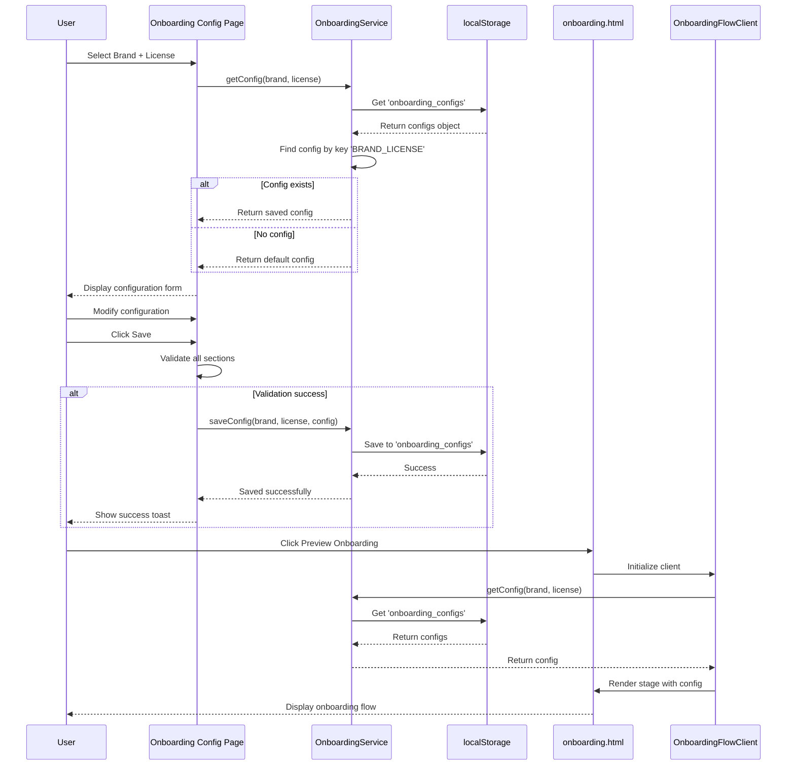

### 3.3 License Matching Flow

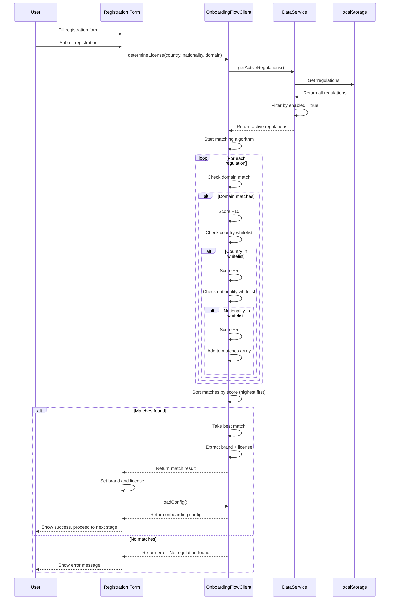

---

## 4. Component Interaction

### 4.1 TagInputManager Component

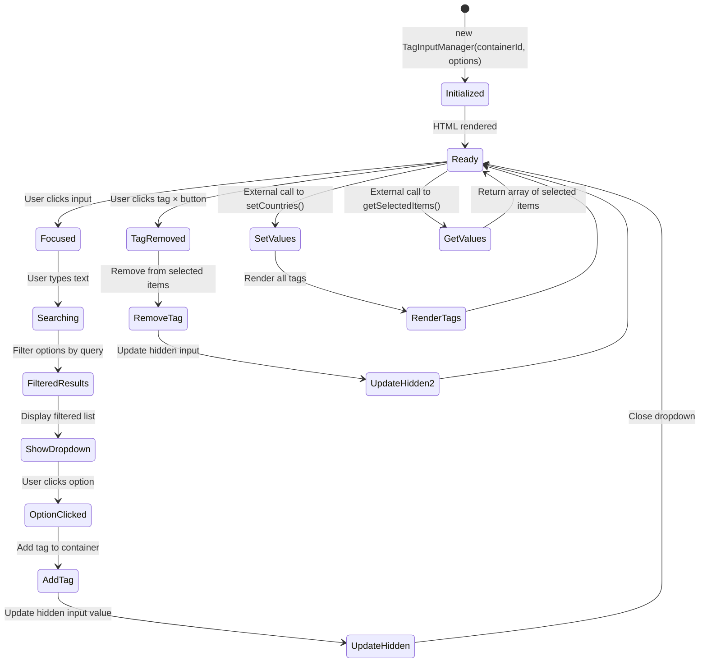

### 4.2 DataTables Integration

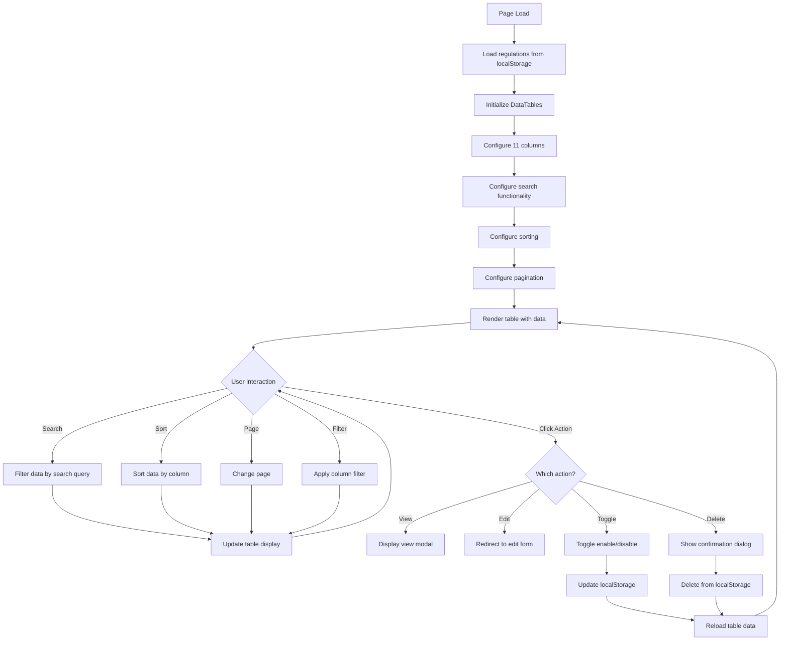

---

## 5. State Management

### 5.1 Application State

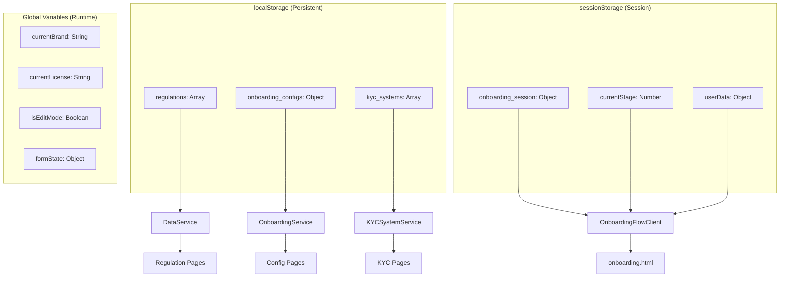

### 5.2 Onboarding State Machine

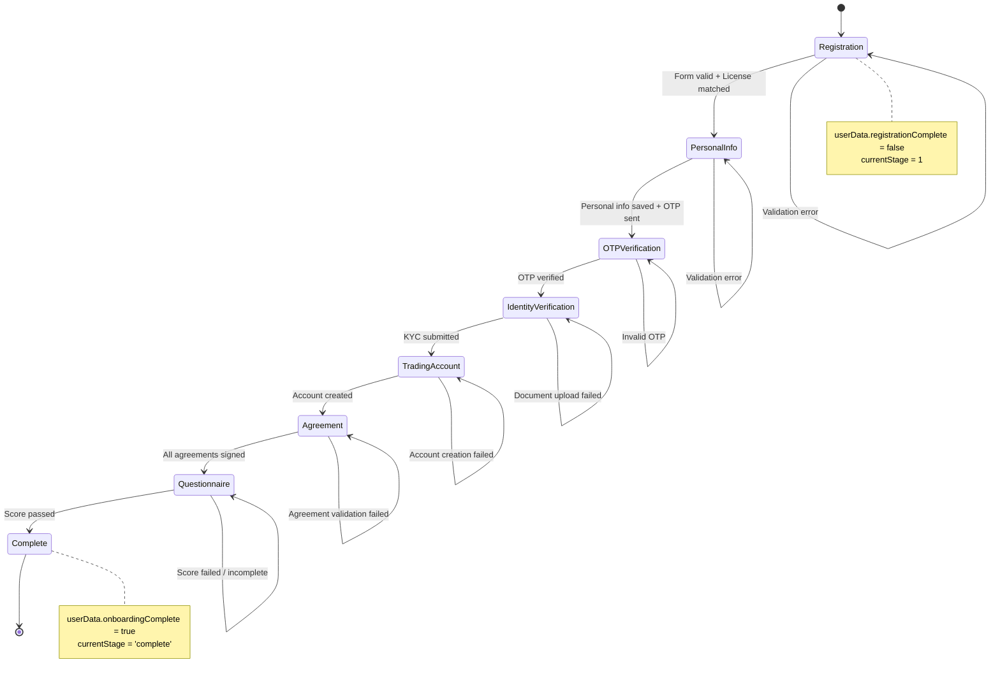

### 5.3 Configuration State Lifecycle

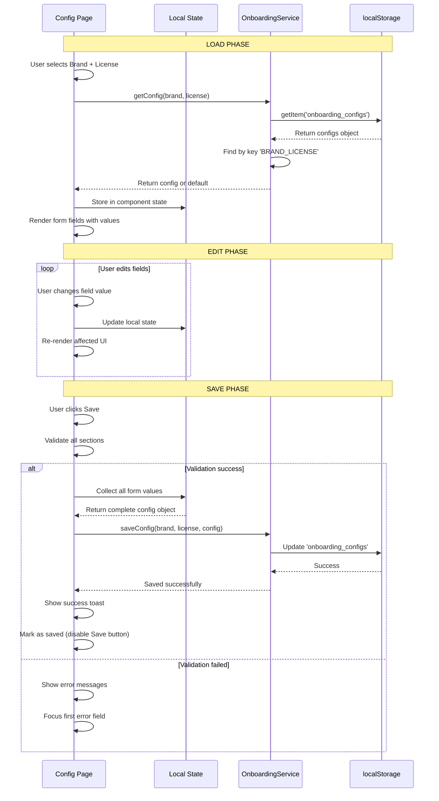

---

## 6. Error Handling Flow

### 6.1 Form Validation Error Handling

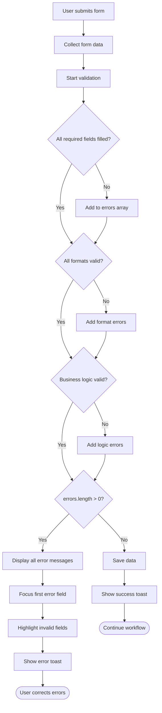

### 6.2 Data Loading Error Handling

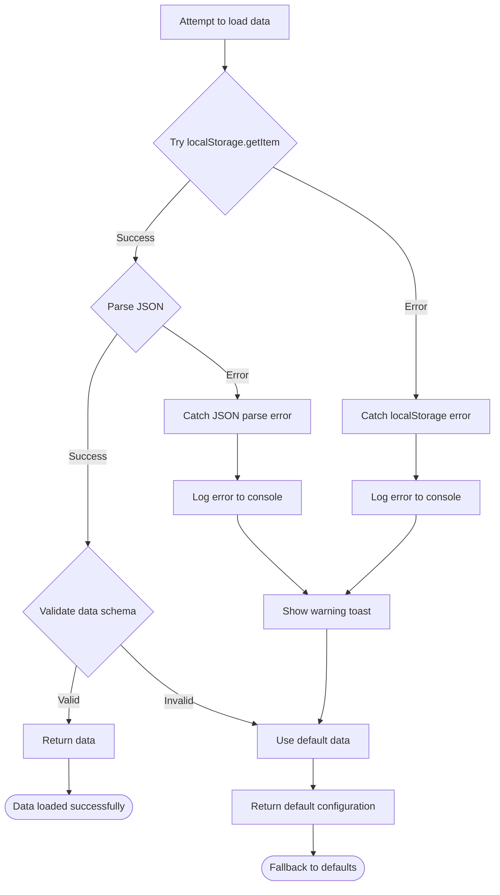

---

## 7. Performance Optimization

### 7.1 Data Loading Strategy

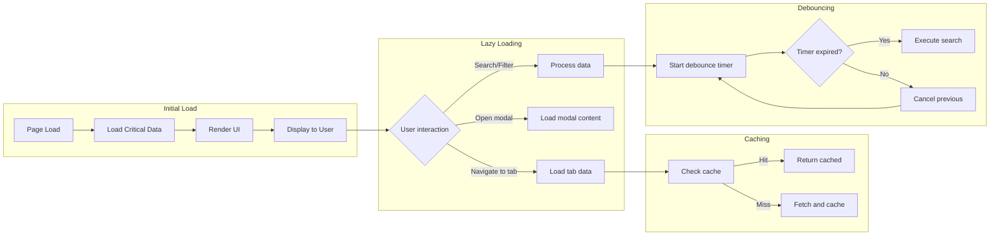

---

## 8. Deployment Flow

### 8.1 CI/CD Pipeline

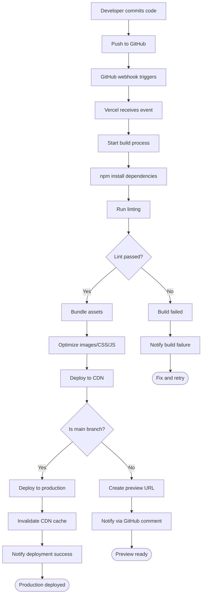

---

**END OF FLOWCHARTS DOCUMENT**
