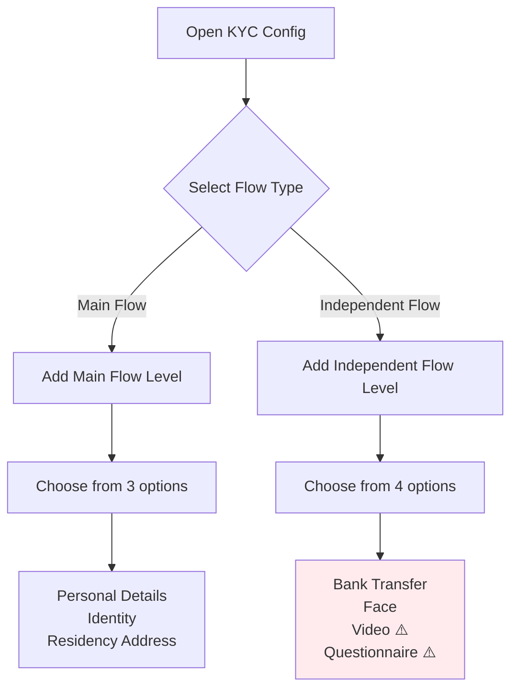
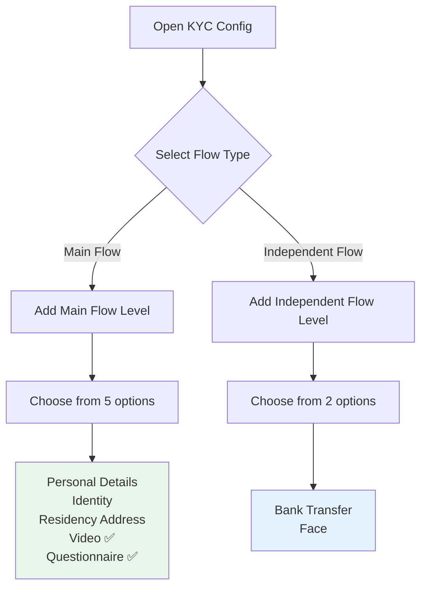

# KYC Level Reorganization - Visual Guide

**Date**: 2026-06-05  
**Change**: Video Verification and Questionnaire Verification moved from Independent Flow to Main Flow

---

## 📊 Before vs After

### BEFORE (Original Structure)

```
┌─────────────────────────────────────────────────────────────────┐
│                         KYC SYSTEM                               │
├─────────────────────────────────────────────────────────────────┤
│                                                                  │
│  ┌─────────────────────────────────────────────────────────┐   │
│  │  MAIN FLOW                                               │   │
│  │  (Primary KYC verification levels)                       │   │
│  │                                                           │   │
│  │  • level1: Personal Details Verification                 │   │
│  │  • level2: Identity Verification                         │   │
│  │  • level3: Residency Address Verification               │   │
│  └─────────────────────────────────────────────────────────┘   │
│                                                                  │
│  ┌─────────────────────────────────────────────────────────┐   │
│  │  INDEPENDENT FLOW                                        │   │
│  │  (Supplementary verification levels)                     │   │
│  │                                                           │   │
│  │  • level11: Bank Transfer Verification                   │   │
│  │  • level12: Face Verification                            │   │
│  │  • level13: Video Verification         ◄── TO MOVE       │   │
│  │  • level14: Questionnaire Verification ◄── TO MOVE       │   │
│  └─────────────────────────────────────────────────────────┘   │
│                                                                  │
└─────────────────────────────────────────────────────────────────┘
```

### AFTER (New Structure) ✅

```
┌─────────────────────────────────────────────────────────────────┐
│                         KYC SYSTEM                               │
├─────────────────────────────────────────────────────────────────┤
│                                                                  │
│  ┌─────────────────────────────────────────────────────────┐   │
│  │  MAIN FLOW                                               │   │
│  │  (Primary KYC verification levels)                       │   │
│  │                                                           │   │
│  │  • level1:  Personal Details Verification                │   │
│  │  • level2:  Identity Verification                        │   │
│  │  • level3:  Residency Address Verification              │   │
│  │  • level13: Video Verification         ◄── MOVED HERE ✅ │   │
│  │  • level14: Questionnaire Verification ◄── MOVED HERE ✅ │   │
│  └─────────────────────────────────────────────────────────┘   │
│                                                                  │
│  ┌─────────────────────────────────────────────────────────┐   │
│  │  INDEPENDENT FLOW                                        │   │
│  │  (Supplementary verification levels)                     │   │
│  │                                                           │   │
│  │  • level11: Bank Transfer Verification                   │   │
│  │  • level12: Face Verification                            │   │
│  └─────────────────────────────────────────────────────────┘   │
│                                                                  │
└─────────────────────────────────────────────────────────────────┘
```

---

## 🔄 User Flow Comparison

### Configuration Workflow

#### BEFORE:


#### AFTER:


---

## 📋 Configuration Overview Table

### Table Structure (Before)

| Row Label | level1 | level2 | level3 | level11 | level12 | level13 ⚠️ | level14 ⚠️ |
|-----------|--------|--------|--------|---------|---------|-----------|-----------|
| **KYC Level** | Personal Details | Identity | Residency | Bank Transfer | Face | **Video** | **Questionnaire** |
| Flow Type | Main | Main | Main | Independent | Independent | **Independent** | **Independent** |
| Trading Account | ✓ | ✓ | ✓ | ✓ | ✓ | ✓ | ✓ |
| Wallet Account | ✓ | ✓ | ✓ | ✓ | ✓ | ✓ | ✓ |

### Table Structure (After)

| Row Label | level1 | level2 | level3 | level13 ✅ | level14 ✅ | level11 | level12 |
|-----------|--------|--------|--------|-----------|-----------|---------|---------|
| **KYC Level** | Personal Details | Identity | Residency | **Video** | **Questionnaire** | Bank Transfer | Face |
| Flow Type | Main | Main | Main | **Main** | **Main** | Independent | Independent |
| Trading Account | ✓ | ✓ | ✓ | ✓ | ✓ | ✓ | ✓ |
| Wallet Account | ✓ | ✓ | ✓ | ✓ | ✓ | ✓ | ✓ |

---

## 🎯 Business Logic Rationale

### Why Move to Main Flow?

#### Video Verification
- **Core KYC Step**: Live video verification is a primary identity check
- **Regulatory Requirement**: Many jurisdictions require video KYC as part of main compliance
- **Sequential Dependency**: Often required before account activation
- **Not Optional**: Not a supplementary check like bank transfer

#### Questionnaire Verification
- **Compliance Mandatory**: Risk assessment questionnaires are core to KYC
- **Customer Profiling**: Essential for understanding customer risk profile
- **Regulatory Standard**: Required by most financial regulators
- **Part of Onboarding**: Typically completed during main onboarding, not as an add-on

#### Why Keep in Independent Flow?

**Bank Transfer Verification** ✅
- Supplementary proof of account ownership
- Optional in many jurisdictions
- Can be done post-account activation
- Used for specific deposit methods

**Face Verification** ✅
- Biometric check (often redundant with video)
- May be optional depending on POI document quality
- Technology-specific enhancement

---

## 🎨 UI Changes

### Dropdown Options

#### "Add Main Flow Level" Button

**Before:**
```
┌─────────────────────────────────────┐
│ Please select                    ▼ │
├─────────────────────────────────────┤
│ Personal Details Verification       │
│ Identity Verification               │
│ Residency Address Verification      │
└─────────────────────────────────────┘
```

**After:**
```
┌─────────────────────────────────────┐
│ Please select                    ▼ │
├─────────────────────────────────────┤
│ Personal Details Verification       │
│ Identity Verification               │
│ Residency Address Verification      │
│ Video Verification              ✅  │
│ Questionnaire Verification      ✅  │
└─────────────────────────────────────┘
```

#### "Add Independent Flow Level" Button

**Before:**
```
┌─────────────────────────────────────┐
│ Please select                    ▼ │
├─────────────────────────────────────┤
│ Bank Transfer Verification          │
│ Face Verification                   │
│ Video Verification              ⚠️  │
│ Questionnaire Verification      ⚠️  │
└─────────────────────────────────────┘
```

**After:**
```
┌─────────────────────────────────────┐
│ Please select                    ▼ │
├─────────────────────────────────────┤
│ Bank Transfer Verification          │
│ Face Verification                   │
└─────────────────────────────────────┘
```

---

## 🔍 Code Implementation Details

### Constants Definition

```javascript
// File: pages/onboarding-flow.html (Line ~4162)

// BEFORE
const MAIN_FLOW_LEVELS = [
    'Personal Details Verification',
    'Identity Verification',
    'Residency Address Verification'
];

const INDEPENDENT_FLOW_LEVELS = [
    'Bank Transfer Verification',
    'Face Verification',
    'Video Verification',        // ⚠️ Remove from here
    'Questionnaire Verification' // ⚠️ Remove from here
];

// AFTER
const MAIN_FLOW_LEVELS = [
    'Personal Details Verification',
    'Identity Verification',
    'Residency Address Verification',
    'Video Verification',        // ✅ Added here
    'Questionnaire Verification' // ✅ Added here
];

const INDEPENDENT_FLOW_LEVELS = [
    'Bank Transfer Verification',
    'Face Verification'
];
```

### Mapping Logic

```javascript
// File: pages/onboarding-flow.html (Line ~3840)

// MAIN FLOW MAPPING (Updated)
const mainLevelMapping = {
    'Personal Details Verification': 'level1',
    'Identity Verification': 'level2',
    'Residency Address Verification': 'level3',
    'Video Verification': 'level13',        // ✅ Now in Main Flow
    'Questionnaire Verification': 'level14' // ✅ Now in Main Flow
};

// INDEPENDENT FLOW MAPPING (Updated)
const independentLevelMapping = {
    'Bank Transfer Verification': 'level11',
    'Face Verification': 'level12'
    // Removed: 'Video Verification': 'level13'
    // Removed: 'Questionnaire Verification': 'level14'
};
```

---

## ✅ Verification Steps

### For Developers

1. **Check Constants**
   ```javascript
   console.log('Main Flow Levels:', MAIN_FLOW_LEVELS.length); // Should be 5
   console.log('Independent Flow Levels:', INDEPENDENT_FLOW_LEVELS.length); // Should be 2
   ```

2. **Verify Dropdown Population**
   - Open KYC Config modal
   - Click "Add Main Flow Level" → Should see 5 options
   - Click "Add Independent Flow Level" → Should see 2 options

3. **Test Configuration Save/Load**
   - Create a Main Flow level with "Video Verification"
   - Save configuration
   - Reload page
   - Verify it loads correctly under Main Flow

### For QA Testers

- [ ] Navigate to Onboarding Flow Configuration
- [ ] Select any KYC System
- [ ] Open Configuration Overview
- [ ] Verify column headers show correct categorization
- [ ] Edit KYC System
- [ ] Add Main Flow Level → Verify 5 options available
- [ ] Add Independent Flow Level → Verify 2 options available
- [ ] Save and verify persistence

---

## 📞 Support & Questions

**Questions?** Contact: Chelsey Chang  
**Documentation**: See `/docs/PRD.md` Section 3.3 for KYC System details

---

**Status**: ✅ Implementation Complete  
**Version**: 1.0  
**Last Updated**: 2026-06-05
