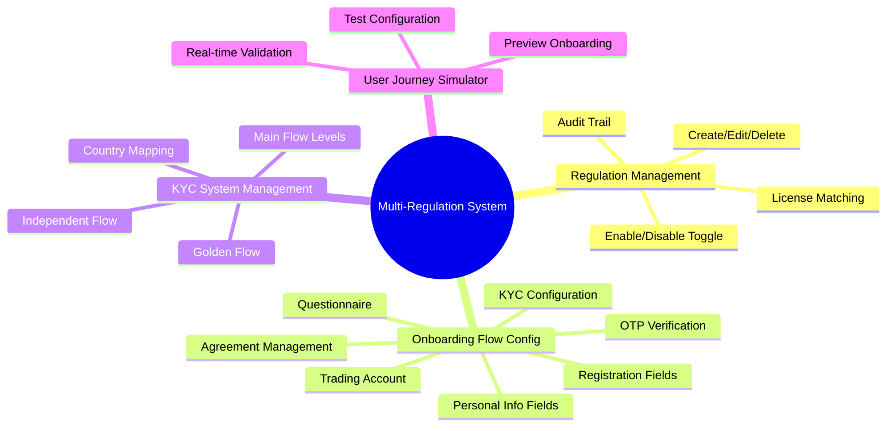
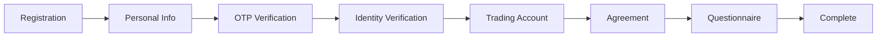
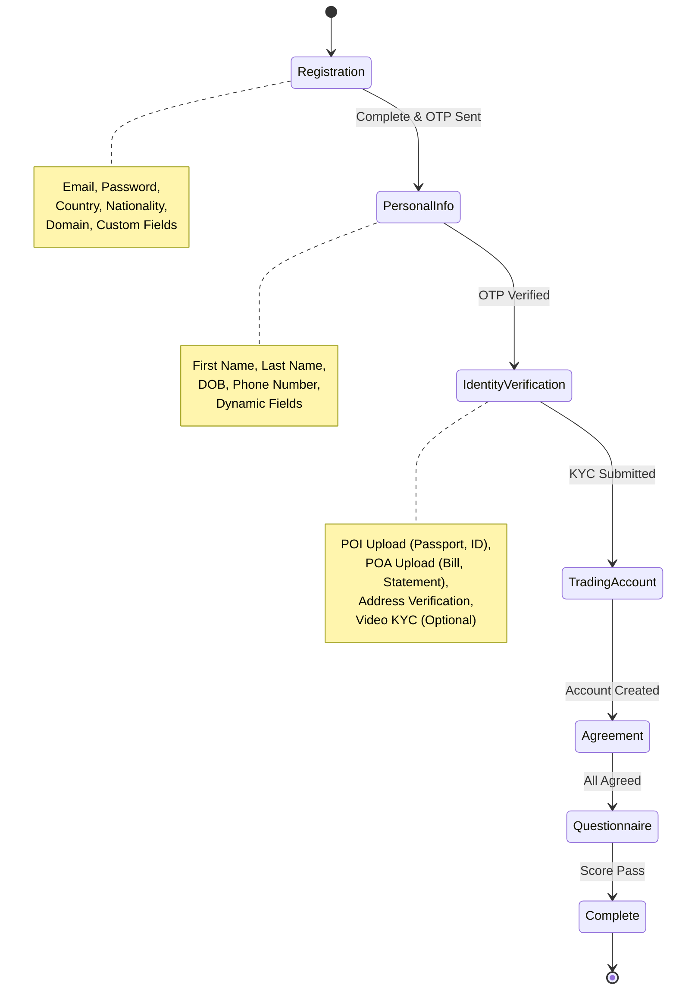
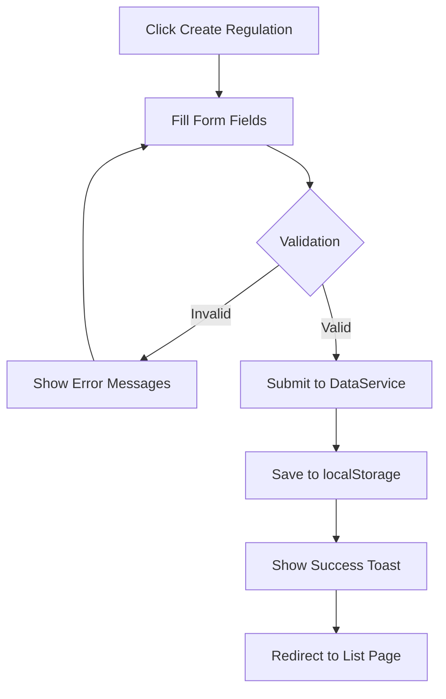
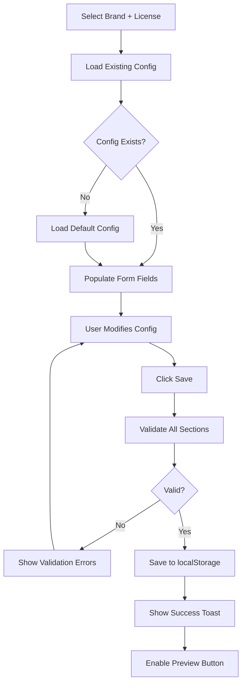
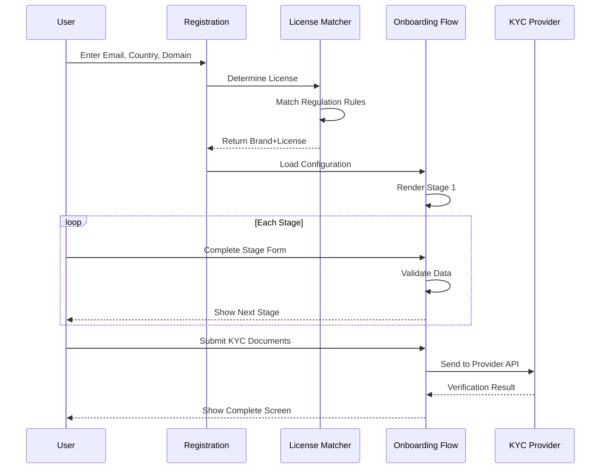

# Multi-Regulation Management System - PRD

**Product Requirements Document**

---

## 📋 Document Information

| Field | Value |
|-------|-------|
| Product Name | Multi-Regulation Management System |
| Version | v1.0 |
| Author | Chelsey Chang |
| Last Updated | 2026-05-16 |
| Status | Production |

---

## 1. Executive Summary

### 1.1 Product Vision

打造一个企业级的**多监管规则配置管理平台**，为OWS（Online Web System）提供灵活的多地区、多监管框架的统一配置管理能力。系统支持V1、V2、ASIC、FCA等多种监管类型，涵盖从用户注册到KYC验证的完整Onboarding流程配置。

### 1.2 Business Goals

- 🎯 **降低运营成本**：通过可视化配置替代代码修改，减少80%的技术支持需求
- 🚀 **加速上线速度**：新监管地区从3周缩短到3天
- 🔒 **增强合规性**：每个监管地区独立配置，确保100%合规
- 📊 **提升可维护性**：配置集中管理，审计追踪全覆盖

### 1.3 Target Users

| User Role | Description | Key Use Cases |
|-----------|-------------|---------------|
| **Compliance Manager** | 合规经理 | 创建和审核监管规则 |
| **Operations Team** | 运营团队 | 配置Onboarding流程 |
| **Product Manager** | 产品经理 | 查看配置报表和分析 |
| **System Administrator** | 系统管理员 | 管理KYC系统和权限 |

---

## 2. Product Overview

### 2.1 Core Features



### 2.2 System Architecture

```
┌─────────────────────────────────────────────────────────────┐
│                      Frontend (SPA)                          │
│  ┌──────────────┐  ┌──────────────┐  ┌──────────────┐      │
│  │  Regulation  │  │  Onboarding  │  │  KYC System  │      │
│  │  Management  │  │  Flow Config │  │    Config    │      │
│  └──────────────┘  └──────────────┘  └──────────────┘      │
│                                                               │
│  ┌──────────────────────────────────────────────────────┐   │
│  │         Router (Hash-based Navigation)               │   │
│  └──────────────────────────────────────────────────────┘   │
│                                                               │
│  ┌──────────────┐  ┌──────────────┐  ┌──────────────┐      │
│  │ Data Service │  │ Onboarding   │  │ KYC System   │      │
│  │   (CRUD)     │  │   Service    │  │   Service    │      │
│  └──────────────┘  └──────────────┘  └──────────────┘      │
└─────────────────────────────────────────────────────────────┘
                            │
                            ▼
                ┌───────────────────────┐
                │   localStorage API    │
                │  (Client-side Cache)  │
                └───────────────────────┘
```

---

## 3. Feature Specifications

### 3.1 Regulation Management

#### 3.1.1 Overview

管理不同监管地区的基础规则，包括品牌、监管类型、License Code等核心信息。

#### 3.1.2 User Stories

**US-R1**: 作为合规经理，我希望创建新的监管规则，以支持新地区业务
- Acceptance Criteria:
  - ✅ 可选择监管类型（V1/V2/ASIC/FCA）
  - ✅ V1/V2时必须填写License Code
  - ✅ 系统自动生成唯一Code（如V2SCA）
  - ✅ 支持设置注册归类模式（域名/国籍/国家）
  - ✅ 保存后显示成功提示

**US-R2**: 作为运营团队，我希望临时禁用某个监管规则，而不是删除它
- Acceptance Criteria:
  - ✅ 每条规则有Enable/Disable开关
  - ✅ 禁用后用户无法在Onboarding中选择该规则
  - ✅ 记录禁用时间和操作人
  - ✅ 可随时重新启用

**US-R3**: 作为系统管理员，我希望查看所有监管规则的列表，并能搜索和筛选
- Acceptance Criteria:
  - ✅ 显示11列信息（Brand、License、Status等）
  - ✅ 支持按Brand、License、Status筛选
  - ✅ 支持全局搜索
  - ✅ 分页显示（每页10/25/50/100条）

#### 3.1.3 Data Model

```typescript
interface Regulation {
  id: number;                    // 时间戳ID
  brand: string;                 // 品牌名称
  regulation: 'V1' | 'V2' | 'ASIC' | 'FCA';
  license: string;               // License Code (V1/V2必填)
  code: string;                  // 自动生成的唯一标识
  description: string;           // 描述信息
  enabled: boolean;              // 是否启用
  
  // 注册归类
  registrationTypes: string[];   // ['域名', '国籍', '国家']
  registrationValues: {
    '客名'?: string;             // 域名白名单
    '国籍'?: {
      whitelist: {
        enabled: boolean;
        values: string[];        // ['Chinese', 'Indonesian']
      };
      blacklist: {
        enabled: boolean;
        values: string[];
      };
    };
    '国家'?: {
      whitelist: {
        enabled: boolean;
        values: string[];        // ['CN', 'ID', 'MY']
      };
      blacklist: {
        enabled: boolean;
        values: string[];
      };
    };
  };
  
  // CP/IBP域名
  restrictionCountry: object;
  cpibpDomain: object;
  
  // 审计字段
  createdAt: string;
  createdBy: string;
  updatedAt: string;
  updatedBy: string;
  statusChangedAt?: string;
  statusChangedBy?: string;
}
```

#### 3.1.4 UI Wireframes

**Regulation List Page**

```
┌────────────────────────────────────────────────────────────┐
│  Multi-Regulation Management System              [Search] │
├────────────────────────────────────────────────────────────┤
│  Regulation Management                                      │
│                                                             │
│  Filters:  [Brand ▼]  [License ▼]  [Status ▼]  [Search]  │
│                                                             │
│  ┌──────────────────────────────────────────────────────┐ │
│  │ Brand │ License │ Code   │ Status  │ Actions         │ │
│  ├──────────────────────────────────────────────────────┤ │
│  │ VAU   │ SCA     │ V2SCA  │ ●Enabled│ 👁 ✏️ ⚡ 🗑      │ │
│  │ VAU   │ VIG     │ V1VIG  │ ●Enabled│ 👁 ✏️ ⚡ 🗑      │ │
│  │ VFM   │ ASIC    │ ASIC   │ ○Disabled│ 👁 ✏️ ⚡ 🗑     │ │
│  └──────────────────────────────────────────────────────┘ │
│                                               Page 1 of 5  │
└────────────────────────────────────────────────────────────┘
```

**Regulation Form Page**

```
┌────────────────────────────────────────────────────────────┐
│  Create/Edit Regulation                                     │
├────────────────────────────────────────────────────────────┤
│                                                             │
│  Brand *          [VAU                    ▼]               │
│  Regulation *     [V2                     ▼]               │
│  License *        [SCA                      ]  (max 5)     │
│  Code             [V2SCA                    ]  (read-only) │
│  Description      [V2监管-新加坡SCA           ]  (max 30)   │
│                                                             │
│  Registration Type:  ☑ Domain  ☑ Nationality  ☐ Country   │
│                                                             │
│  Domain Whitelist:                                         │
│    [All ▼]  (vantagemarkets.sg, ows.vantage...)           │
│                                                             │
│  Nationality Configuration:                                │
│    ◉ Whitelist  ○ Blacklist                               │
│    [Indonesian  ×] [Chinese  ×] [+ Add]                    │
│                                                             │
│                               [Cancel]  [Save Regulation]  │
└────────────────────────────────────────────────────────────┘
```

---

### 3.2 Onboarding Flow Configuration

#### 3.2.1 Overview

为每个Brand+License组合配置完整的用户Onboarding流程，包括7个阶段的详细配置。

#### 3.2.2 Configuration Stages



#### 3.2.3 User Stories

**US-O1**: 作为产品经理，我希望配置注册阶段的表单字段
- Acceptance Criteria:
  - ✅ 可添加/编辑/删除自定义字段
  - ✅ 支持8种字段类型（text/email/tel/select/radio/checkbox/date/number）
  - ✅ 每个字段可设置：required、placeholder、validation
  - ✅ 实时预览效果

**US-O2**: 作为合规经理，我希望配置KYC验证流程
- Acceptance Criteria:
  - ✅ 选择KYC Provider（Sumsub/Onfido/Advance AI）
  - ✅ 配置POI文档类型（多选下拉框）
  - ✅ 配置POA文档类型（多选下拉框）
  - ✅ 配置POA地址验证规则（City/State/Street）
  - ✅ 可选H5验证页面

**US-O3**: 作为运营团队，我希望配置Golden Flow的KYC等级体系
- Acceptance Criteria:
  - ✅ 可添加多个KYC System
  - ✅ 配置Main Flow Levels（L0-L7）
  - ✅ 配置Independent Flow（独立流程）
  - ✅ 按国家映射不同KYC System

**US-O4**: 作为产品经理，我希望配置Questionnaire问卷
- Acceptance Criteria:
  - ✅ 开启/关闭问卷功能
  - ✅ 添加单选/多选/文本题
  - ✅ 配置选项的popup弹窗
  - ✅ 设置评分系统和通过标准

#### 3.2.4 Data Model

```typescript
interface OnboardingConfig {
  brand: string;
  license: string;
  
  // 1. Registration Fields
  registrationFields: {
    [key: string]: {
      type: 'text' | 'email' | 'tel' | 'select' | 'radio' | 'checkbox' | 'date' | 'number';
      label: string;
      placeholder?: string;
      required: boolean;
      enabled: boolean;
      validation?: string;
      options?: string[];   // for select/radio/checkbox
    };
  };
  
  // 2. Personal Info Fields
  personalInfoFields: Array<{
    key: string;
    label: string;
    type: string;
    required: boolean;
    enabled: boolean;
    placeholder?: string;
    options?: string[];
  }>;
  
  // 3. OTP Configuration
  otpConfig: {
    email: {
      enabled: boolean;
      provider?: string;
    };
    phone: {
      enabled: boolean;
      countries: string[];  // 允许手机验证的国家
      provider?: string;
    };
  };
  
  // 4. KYC Configuration
  kycConfig: {
    provider: 'Sumsub' | 'Onfido' | 'Advance AI' | 'Green ID';
    poiDocuments: string[];  // ['Passport', 'National ID Card', ...]
    poaDocuments: string[];  // ['Bank Statement', 'Utility Bill', ...]
    poaAddressValidation: {
      city: boolean;
      state: boolean;
      street: boolean;
    };
    h5Verification: {
      enabled: boolean;
      route?: string;
    };
  };
  
  // 5. Golden Flow Configuration
  goldenFlowConfig: {
    kycSystems: Array<{
      id: number;
      type: 'Standard' | 'Custom';
      name: string;
      countries: string[];  // ['All'] or ['CN', 'ID']
      config: {
        mainFlowLevels: string[];      // ['L0', 'L1', 'L2', ...]
        independentFlowLevels: string[]; // ['C1', 'C2', ...]
      };
    }>;
  };
  
  // 6. Trading Account Configuration
  tradingAccountConfig: {
    primary: {
      enabled: boolean;
      defaultType: 'MT4' | 'MT5';
    };
    secondary: {
      enabled: boolean;
      supportedTypes: string[];
    };
  };
  
  // 7. Agreement Configuration
  agreementConfig: {
    items: Array<{
      key: string;
      title: string;
      type: 'pdf' | 'html' | 'url';
      content: string;
      required: boolean;
    }>;
    selectionMethod: 'all' | 'any';
    generatePdf: boolean;
  };
  
  // 8. Questionnaire Configuration
  questionnaireConfig: {
    enabled: boolean;
    questions: Array<{
      id: string;
      type: 'single' | 'multiple' | 'text';
      question: string;
      options?: Array<{
        value: string;
        label: string;
        score?: number;
        popup?: {
          enabled: boolean;
          title: string;
          content: string;
          requireConfirmation: boolean;
        };
      }>;
      required: boolean;
    }>;
    scoring: {
      enabled: boolean;
      passCriteria: {
        type: 'total' | 'percentage';
        value: number;
      };
    };
  };
  
  // Audit
  createdAt: string;
  updatedAt: string;
}
```

#### 3.2.5 UI Wireframes

**Onboarding Flow Config - Main Page**

```
┌────────────────────────────────────────────────────────────┐
│ Onboarding Flow Configuration                               │
├────────────────────────────────────────────────────────────┤
│ Brand: [VAU  ▼]  License: [SCA  ▼]         [Search Config] │
├────────────────────────────────────────────────────────────┤
│ Tabs:                                                       │
│ [Registration] [Personal Info] [OTP] [KYC] [Trading]       │
│ [Agreement] [Questionnaire]                                 │
├────────────────────────────────────────────────────────────┤
│                                                             │
│ 📝 Registration Configuration                               │
│                                                             │
│ ┌─────────────────────────────────────────────────────┐   │
│ │ Default Fields                                       │   │
│ │ • Email *         [✓ Enabled]  [Edit]               │   │
│ │ • Password *      [✓ Enabled]  [Edit]               │   │
│ │ • Country *       [✓ Enabled]  [Edit]               │   │
│ │ • Nationality *   [✓ Enabled]  [Edit]               │   │
│ └─────────────────────────────────────────────────────┘   │
│                                                             │
│ ┌─────────────────────────────────────────────────────┐   │
│ │ Custom Fields                          [+ Add Field] │   │
│ │ • Referral Code   [✓ Enabled]  [Edit]  [Delete]    │   │
│ │ • Phone Number    [✓ Enabled]  [Edit]  [Delete]    │   │
│ └─────────────────────────────────────────────────────┘   │
│                                                             │
│                      [Preview Onboarding]  [Save Config]   │
└────────────────────────────────────────────────────────────┘
```

**KYC Configuration Tab**

```
┌────────────────────────────────────────────────────────────┐
│ 🔐 KYC Configuration                                        │
├────────────────────────────────────────────────────────────┤
│                                                             │
│ 1. Document Type Configuration                              │
│                                                             │
│ ┌──── Proof of Identity (POI) ─────────────────────┐      │
│ │ Accepted Documents *                              │      │
│ │ [Type to search POI documents...           ▼]    │      │
│ │ [Passport ×] [National ID Card ×] [Driver's...   │      │
│ └───────────────────────────────────────────────────┘      │
│                                                             │
│ ┌──── Proof of Address (POA) ──────────────────────┐      │
│ │ Accepted Documents *                              │      │
│ │ [Type to search POA documents...           ▼]    │      │
│ │ [Bank Statement ×] [Utility Bill ×] [Tax Bill... │      │
│ │ ⚠️ POA documents must be dated within 3 months    │      │
│ └───────────────────────────────────────────────────┘      │
│                                                             │
│ 2. POA Address Validation                                   │
│                                                             │
│ Address Fields to Validate:                                │
│   ☑ City    ☑ State    ☐ Street                           │
│                                                             │
│ ℹ️ Document types will be sent as acceptedDocTypes to API  │
│                                                             │
│                                         [Save Configuration]│
└────────────────────────────────────────────────────────────┘
```

**Questionnaire Configuration Tab**

```
┌────────────────────────────────────────────────────────────┐
│ 📋 Questionnaire Configuration                              │
├────────────────────────────────────────────────────────────┤
│                                                             │
│ Enable Questionnaire:  ◉ Yes  ○ No                         │
│                                                             │
│ ┌─────────────────────────────────────────────────────┐   │
│ │ Questions List                      [+ Add Question] │   │
│ │                                                       │   │
│ │ Q1. What is your investment experience?              │   │
│ │     Type: Single Choice    Score: Enabled            │   │
│ │     Options:                                          │   │
│ │     • None (0 points)                                 │   │
│ │     • 1-2 years (5 points)                           │   │
│ │     • 3-5 years (10 points)                          │   │
│ │     • 5+ years (15 points)                           │   │
│ │     [Edit]  [Delete]  [⬆]  [⬇]                       │   │
│ │                                                       │   │
│ │ Q2. What is your risk tolerance?                     │   │
│ │     Type: Single Choice    Score: Enabled            │   │
│ │     [Edit]  [Delete]  [⬆]  [⬇]                       │   │
│ └─────────────────────────────────────────────────────┘   │
│                                                             │
│ Scoring Configuration:                                      │
│   Pass Criteria: ◉ Total Score  ○ Percentage               │
│   Minimum Score: [60        ] points                        │
│                                                             │
│                                         [Save Configuration]│
└────────────────────────────────────────────────────────────┘
```

---

### 3.3 KYC System Management

#### 3.3.1 Overview

管理Golden Flow的KYC等级体系，定义Main Flow和Independent Flow的级别配置。

#### 3.3.2 User Stories

**US-K1**: 作为合规经理，我希望创建新的KYC System
- Acceptance Criteria:
  - ✅ 输入System Name
  - ✅ 选择System Type（Standard/Custom）
  - ✅ 配置Main Flow Levels（可多选）
  - ✅ 配置Independent Flow Levels（可多选）
  - ✅ 保存后可在Onboarding Config中使用

**US-K2**: 作为产品经理，我希望查看所有KYC Systems
- Acceptance Criteria:
  - ✅ 列表显示所有System
  - ✅ 显示System Type、Levels、Usage Count
  - ✅ 可编辑和删除（未使用的System）
  - ✅ 可复制现有System创建新的

#### 3.3.3 Data Model

```typescript
interface KYCSystem {
  id: number;
  name: string;
  type: 'Standard' | 'Custom';
  description?: string;
  
  config: {
    mainFlowLevels: string[];      // ['L0', 'L1', 'L2', 'L3', 'L4', 'L5', 'L6', 'L7']
    independentFlowLevels: string[]; // ['C1', 'C2', 'C3', 'C4']
  };
  
  // Audit
  createdAt: string;
  createdBy: string;
  updatedAt: string;
  updatedBy: string;
}
```

#### 3.3.4 UI Wireframes

```
┌────────────────────────────────────────────────────────────┐
│ KYC System Configuration                                    │
├────────────────────────────────────────────────────────────┤
│                                                             │
│ ┌─────────────────────────────────────────────────────┐   │
│ │ KYC Systems                          [+ Create New]  │   │
│ │                                                       │   │
│ │ ID │ Name           │ Type     │ Levels │ Actions   │   │
│ │────┼────────────────┼──────────┼────────┼──────────│   │
│ │ 1  │ 通用KYC体系     │ Standard │ L0-L7  │ ✏️ 📋     │   │
│ │ 2  │ 简化KYC体系     │ Custom   │ L0-L3  │ ✏️ 🗑 📋  │   │
│ │ 3  │ 高级KYC体系     │ Custom   │ L0-L7  │ ✏️ 🗑 📋  │   │
│ └─────────────────────────────────────────────────────┘   │
│                                                             │
└────────────────────────────────────────────────────────────┘
```

---

### 3.4 User Journey Simulator (onboarding.html)

#### 3.4.1 Overview

实时预览用户Onboarding流程，基于配置动态渲染每个阶段的UI。

#### 3.4.2 User Stories

**US-S1**: 作为产品经理，我希望预览完整的Onboarding流程
- Acceptance Criteria:
  - ✅ 输入测试数据（Email、Country等）
  - ✅ 系统自动匹配Brand+License
  - ✅ 逐步展示7个阶段的UI
  - ✅ 表单验证实时生效

**US-S2**: 作为开发人员，我希望测试不同配置的效果
- Acceptance Criteria:
  - ✅ 可切换Brand+License组合
  - ✅ 修改配置后立即生效
  - ✅ Console显示详细日志
  - ✅ 可保存测试数据到sessionStorage

#### 3.4.3 Flow Diagram



#### 3.4.4 UI Screenshots

**Stage 1: Registration**

```
┌────────────────────────────────────────────────────────────┐
│ ● ○ ○ ○ ○ ○ ○   Registration                              │
├────────────────────────────────────────────────────────────┤
│                                                             │
│ Email Address *                                             │
│ [example@email.com                                    ]     │
│                                                             │
│ Password *                                                  │
│ [••••••••                                             ]     │
│                                                             │
│ Country *                                                   │
│ [Singapore                                            ▼]    │
│                                                             │
│ Nationality *                                               │
│ [Singaporean                                          ▼]    │
│                                                             │
│ Domain *                                                    │
│ [vantagemarkets.sg                                    ▼]    │
│                                                             │
│ ☑ I agree to Terms & Conditions                            │
│                                                             │
│                                      [Continue Registration]│
└────────────────────────────────────────────────────────────┘
```

**Stage 4: Identity Verification**

```
┌────────────────────────────────────────────────────────────┐
│ ○ ○ ○ ● ○ ○ ○   Identity Verification                     │
├────────────────────────────────────────────────────────────┤
│                                                             │
│ 📄 1. Document Type Configuration                          │
│                                                             │
│ ┌──── Proof of Identity (POI) ────────────────────┐       │
│ │ Selected: Passport, National ID Card             │       │
│ │ [📤 Upload POI Document]                         │       │
│ │ ✅ passport_john_doe.pdf (2.3MB)                 │       │
│ └──────────────────────────────────────────────────┘       │
│                                                             │
│ ┌──── Proof of Address (POA) ──────────────────────┐      │
│ │ Selected: Bank Statement, Utility Bill           │      │
│ │ [📤 Upload POA Document]                         │      │
│ │ ✅ bank_statement_2026_04.pdf (1.8MB)            │      │
│ └──────────────────────────────────────────────────┘      │
│                                                             │
│ 🏠 2. POA Address Validation                                │
│                                                             │
│ City *         [Singapore                           ]       │
│ State          [Central Region                      ]       │
│                                                             │
│                              [Back]  [Submit Documents]     │
└────────────────────────────────────────────────────────────┘
```

---

## 4. Technical Requirements

### 4.1 Frontend Stack

| Technology | Version | Purpose |
|------------|---------|---------|
| HTML5 | - | Semantic markup |
| CSS3 | - | Styling & animations |
| JavaScript (ES6+) | - | Business logic |
| Bootstrap | 5.3.0 | UI framework |
| jQuery | 3.7.0 | DOM manipulation |
| DataTables.js | 1.13.6 | Table component |
| Font Awesome | 6.4.0 | Icons |

### 4.2 Browser Compatibility

| Browser | Min Version | Support Level |
|---------|-------------|---------------|
| Chrome | 90+ | ✅ Full Support |
| Firefox | 88+ | ✅ Full Support |
| Safari | 14+ | ✅ Full Support |
| Edge | 90+ | ✅ Full Support |
| IE11 | - | ❌ Not Supported |

### 4.3 Performance Requirements

| Metric | Target | Measurement |
|--------|--------|-------------|
| Page Load Time | < 2s | First Contentful Paint |
| Time to Interactive | < 3s | Lighthouse TTI |
| Bundle Size | < 500KB | Gzipped |
| API Response Time | < 500ms | localStorage read/write |

### 4.4 Data Storage

```javascript
// localStorage Structure
{
  "regulations": [
    { id: 1, brand: "VAU", license: "SCA", ... },
    { id: 2, brand: "VAU", license: "VIG", ... }
  ],
  
  "onboarding_configs": {
    "VAU_SCA": {
      registrationFields: {...},
      kycConfig: {...},
      ...
    },
    "VAU_VIG": {...}
  },
  
  "kyc_systems": [
    { id: 1, name: "通用KYC体系", config: {...} },
    { id: 2, name: "简化KYC体系", config: {...} }
  ],
  
  "onboarding_session": {
    currentStage: 3,
    userData: {...},
    brand: "VAU",
    license: "SCA"
  }
}
```

### 4.5 Security Considerations

- ✅ Client-side validation for all inputs
- ✅ XSS protection (escape user input)
- ✅ CSRF protection (for future API integration)
- ✅ Audit trail for all configuration changes
- ⚠️ Note: No authentication in current version (admin tool)

---

## 5. User Interface Design

### 5.1 Design System

#### Color Palette

```css
/* Primary Colors */
--primary: #00B4B4;      /* OWS Teal */
--secondary: #2C3E50;    /* Dark Blue */

/* Semantic Colors */
--success: #10B981;      /* Green */
--danger: #EF4444;       /* Red */
--warning: #F59E0B;      /* Orange */
--info: #3B82F6;         /* Blue */

/* Neutral Colors */
--gray-50: #F9FAFB;
--gray-100: #F3F4F6;
--gray-200: #E5E7EB;
--gray-300: #D1D5DB;
--gray-500: #6B7280;
--gray-700: #374151;
--gray-900: #111827;
```

#### Typography

```css
/* Font Family */
font-family: -apple-system, BlinkMacSystemFont, 
             'Segoe UI', Roboto, 'Helvetica Neue', 
             Arial, sans-serif;

/* Font Sizes */
--text-xs: 12px;
--text-sm: 13px;
--text-base: 14px;
--text-lg: 16px;
--text-xl: 18px;
--text-2xl: 20px;
--text-3xl: 24px;

/* Font Weights */
--font-normal: 400;
--font-medium: 500;
--font-semibold: 600;
--font-bold: 700;
```

#### Spacing Scale (8px base)

```css
--spacing-1: 4px;
--spacing-2: 8px;
--spacing-3: 12px;
--spacing-4: 16px;
--spacing-5: 20px;
--spacing-6: 24px;
--spacing-8: 32px;
--spacing-10: 40px;
--spacing-12: 48px;
```

### 5.2 Component Library

#### Buttons

```html
<!-- Primary Button -->
<button class="btn btn-primary">
  <i class="fas fa-save"></i> Save Configuration
</button>

<!-- Secondary Button -->
<button class="btn btn-secondary">
  <i class="fas fa-times"></i> Cancel
</button>

<!-- Icon Button -->
<button class="btn-icon btn-icon-edit">
  <i class="fas fa-edit"></i>
</button>
```

#### Form Controls

```html
<!-- Text Input -->
<input type="text" class="form-control" placeholder="Enter value...">

<!-- Select Dropdown -->
<select class="form-select">
  <option value="">Choose...</option>
</select>

<!-- Multi-Select (TagInputManager) -->
<div id="poi_documents_selector"></div>

<!-- Checkbox -->
<div class="form-check">
  <input type="checkbox" class="form-check-input" id="enabled">
  <label class="form-check-label" for="enabled">Enabled</label>
</div>

<!-- Radio Group -->
<div class="form-check">
  <input type="radio" class="form-check-input" name="type" id="whitelist">
  <label class="form-check-label" for="whitelist">Whitelist</label>
</div>
```

#### Cards

```html
<div class="card config-card">
  <div class="card-header">
    <h3 class="card-title">
      <i class="fas fa-cog"></i> Configuration Title
    </h3>
    <p class="card-subtitle">Description text...</p>
  </div>
  <div class="card-body">
    <!-- Content -->
  </div>
</div>
```

#### Badges

```html
<span class="badge badge-success">
  <i class="fas fa-check-circle"></i> Enabled
</span>

<span class="badge badge-secondary">
  <i class="fas fa-ban"></i> Disabled
</span>
```

---

## 6. User Flows

### 6.1 Create New Regulation Flow



### 6.2 Configure Onboarding Flow



### 6.3 User Onboarding Journey



---

## 7. Testing Strategy

### 7.1 Unit Testing

**Test Coverage Goals**: 80%

```javascript
// Example: Regulation Code Generation
describe('generateRegulationCode', () => {
  test('V1 + SVG = V1SVG', () => {
    expect(generateCode('V1', 'SVG')).toBe('V1SVG');
  });
  
  test('V2 + SCA = V2SCA', () => {
    expect(generateCode('V2', 'SCA')).toBe('V2SCA');
  });
  
  test('ASIC = ASIC', () => {
    expect(generateCode('ASIC', '')).toBe('ASIC');
  });
});
```

### 7.2 Integration Testing

**Test Scenarios**:
- ✅ Create regulation → Appears in list
- ✅ Edit regulation → Changes saved
- ✅ Delete regulation → Removed from list
- ✅ Enable/Disable toggle → Status updated
- ✅ Save config → Available in onboarding.html
- ✅ License matching → Correct Brand+License selected

### 7.3 User Acceptance Testing (UAT)

**Test Cases**:

| Test ID | Scenario | Expected Result | Priority |
|---------|----------|----------------|----------|
| UAT-R1 | Create V2SCA regulation | Code auto-generated, saved successfully | P0 |
| UAT-R2 | Disable regulation | User cannot select in onboarding | P0 |
| UAT-O1 | Configure POI/POA with dropdown | Selected items saved and loaded | P0 |
| UAT-O2 | Add custom registration field | Field appears in onboarding preview | P1 |
| UAT-O3 | Configure questionnaire with popup | Popup shown when option selected | P1 |
| UAT-S1 | Complete full onboarding flow | All stages render correctly | P0 |

### 7.4 Browser Testing Matrix

| Feature | Chrome | Firefox | Safari | Edge |
|---------|--------|---------|--------|------|
| Regulation CRUD | ✅ | ✅ | ✅ | ✅ |
| Onboarding Config | ✅ | ✅ | ✅ | ✅ |
| TagInputManager | ✅ | ✅ | ✅ | ✅ |
| DataTables | ✅ | ✅ | ✅ | ✅ |
| localStorage | ✅ | ✅ | ✅ | ✅ |

---

## 8. Deployment & Rollout

### 8.1 Deployment Architecture

```
┌─────────────────────────────────────────────────────────┐
│                    Vercel CDN                            │
│              (Global Edge Network)                       │
└─────────────────────────────────────────────────────────┘
                         │
                         ▼
┌─────────────────────────────────────────────────────────┐
│          Static Assets (HTML/CSS/JS)                     │
│   • index.html                                           │
│   • pages/*.html                                         │
│   • assets/css/*.css                                     │
│   • assets/js/*.js                                       │
│   • assets/data/*.json                                   │
└─────────────────────────────────────────────────────────┘
                         │
                         ▼
┌─────────────────────────────────────────────────────────┐
│           Browser (Client-side)                          │
│   • localStorage for data persistence                    │
│   • sessionStorage for onboarding state                 │
└─────────────────────────────────────────────────────────┘
```

### 8.2 Rollout Plan

#### Phase 1: Internal Testing (Week 1-2)
- Deploy to staging environment
- Internal team testing
- Fix critical bugs
- Performance optimization

#### Phase 2: Beta Testing (Week 3-4)
- Limited user group (5-10 users)
- Collect feedback
- Iterate on UX issues
- Monitor console errors

#### Phase 3: Production Release (Week 5)
- Deploy to production
- Monitor error rates
- Provide user training
- Create documentation

### 8.3 Rollback Plan

If critical issues occur:
1. Revert to previous Git commit
2. Trigger Vercel redeploy
3. Notify users of downtime (< 5 mins)
4. Fix issues in development branch
5. Re-deploy after testing

---

## 9. Success Metrics (KPIs)

### 9.1 Product Metrics

| Metric | Target | Measurement Method |
|--------|--------|-------------------|
| Configuration Creation Time | < 15 min | Time from start to save |
| User Onboarding Completion Rate | > 85% | Completed / Started |
| Configuration Error Rate | < 5% | Invalid saves / Total saves |
| System Uptime | > 99.5% | Vercel monitoring |

### 9.2 User Satisfaction Metrics

| Metric | Target | Measurement Method |
|--------|--------|-------------------|
| User Satisfaction Score (CSAT) | > 4.0/5.0 | Post-task survey |
| Task Success Rate | > 90% | Successful completions |
| Time on Task | < 10 min | Average time per config |
| Support Ticket Volume | < 5/month | Ticket tracking system |

### 9.3 Business Impact Metrics

| Metric | Baseline | Target | Timeline |
|--------|----------|--------|----------|
| New Region Launch Time | 3 weeks | 3 days | Q2 2026 |
| Configuration Changes | 5/month | 20/month | Q2 2026 |
| Technical Support Hours | 40h/month | 10h/month | Q3 2026 |
| Compliance Audit Pass Rate | 85% | 100% | Q3 2026 |

---

## 10. Future Enhancements (Roadmap)

### 10.1 Q3 2026

**Backend API Integration**
- [ ] Replace localStorage with REST API
- [ ] User authentication & authorization
- [ ] Role-based access control (RBAC)
- [ ] Real-time collaboration (multi-user editing)

**Advanced Features**
- [ ] Configuration version control
- [ ] Config diff comparison
- [ ] Rollback to previous versions
- [ ] Configuration templates library

### 10.2 Q4 2026

**Analytics & Reporting**
- [ ] Configuration usage dashboard
- [ ] Onboarding funnel analysis
- [ ] A/B testing framework
- [ ] Export reports (PDF/Excel)

**Integration**
- [ ] Slack notifications
- [ ] Email alerts for config changes
- [ ] Jira integration for compliance tracking
- [ ] Webhook support for external systems

### 10.3 2027

**AI/ML Features**
- [ ] Smart configuration recommendations
- [ ] Anomaly detection (unusual patterns)
- [ ] Auto-complete for form fields
- [ ] Natural language config input

**Mobile App**
- [ ] iOS app for configuration management
- [ ] Android app for configuration management
- [ ] Push notifications
- [ ] Offline mode with sync

---

## 11. Appendix

### 11.1 Glossary

| Term | Definition |
|------|------------|
| **Regulation** | 监管类型（V1/V2/ASIC/FCA） |
| **License** | 牌照代码（如SCA、VIG、SVG） |
| **Code** | 自动生成的唯一标识符（如V2SCA） |
| **Brand** | 品牌名称（如VAU、VFM） |
| **Onboarding** | 用户注册入金的完整流程 |
| **KYC** | Know Your Customer，身份验证 |
| **POI** | Proof of Identity，身份证明 |
| **POA** | Proof of Address，地址证明 |
| **Golden Flow** | KYC等级流程体系 |
| **TagInputManager** | 标签式多选输入组件 |

### 11.2 References

- [Bootstrap 5.3 Documentation](https://getbootstrap.com/docs/5.3/)
- [DataTables Documentation](https://datatables.net/)
- [jQuery API Documentation](https://api.jquery.com/)
- [Vercel Deployment Guide](https://vercel.com/docs)

### 11.3 Document History

| Version | Date | Author | Changes |
|---------|------|--------|---------|
| 1.0 | 2026-05-16 | Chelsey Chang | Initial PRD creation |

---

## 📝 Sign-off

### Approvals

| Role | Name | Signature | Date |
|------|------|-----------|------|
| Product Manager | Chelsey Chang | ✓ | 2026-05-16 |
| Engineering Lead | _______________ | ___ | __________ |
| Design Lead | _______________ | ___ | __________ |
| Compliance Lead | _______________ | ___ | __________ |

---

**END OF DOCUMENT**
